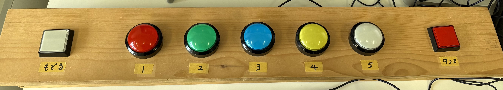
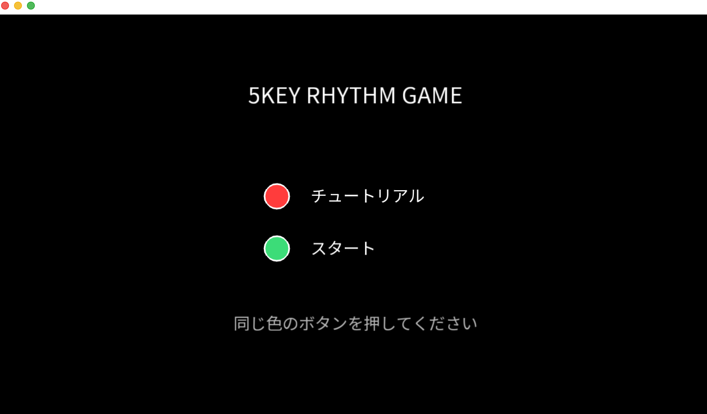
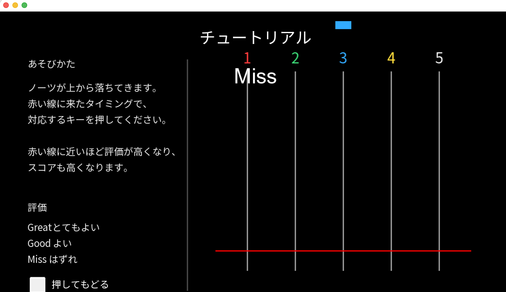
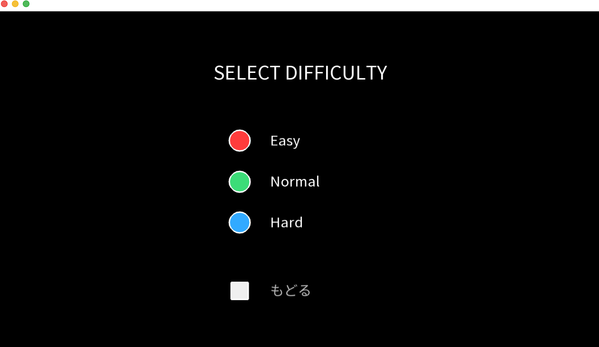
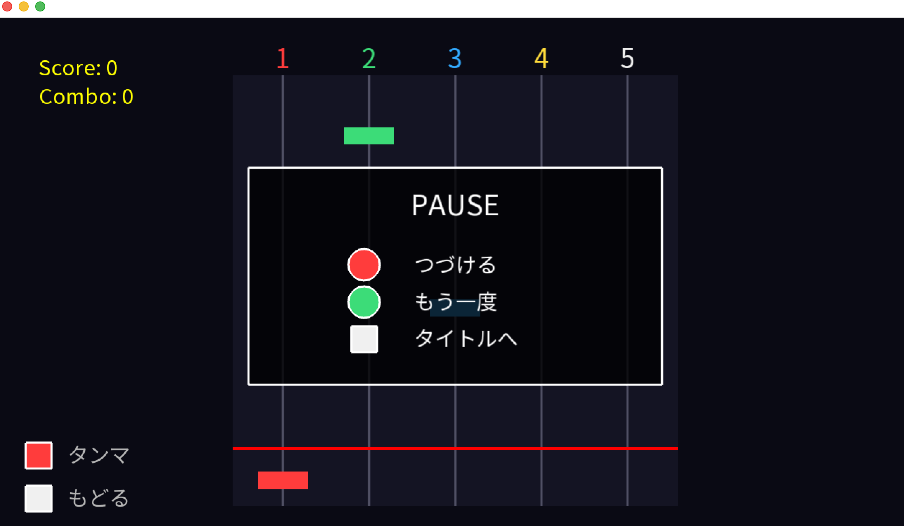
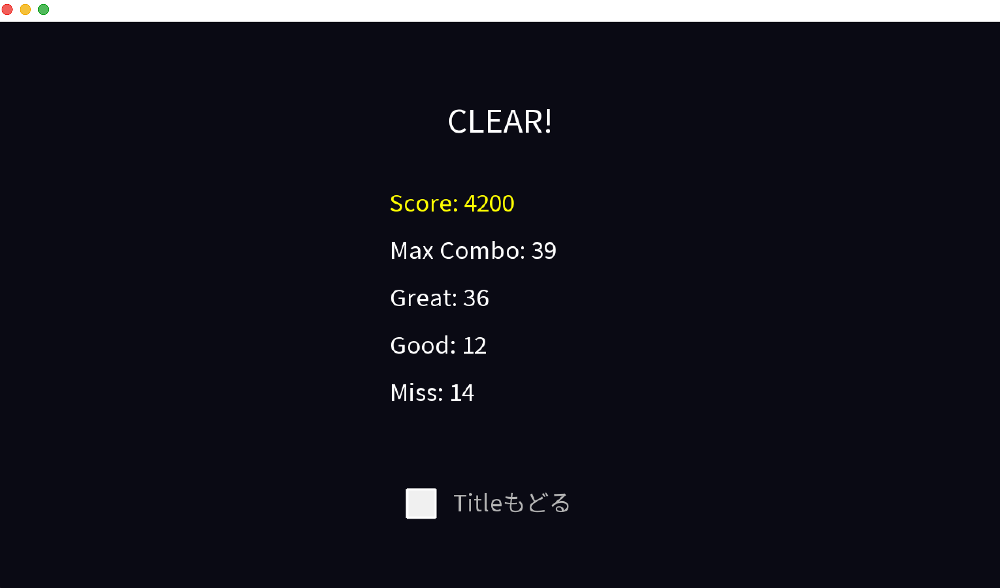

# Rhythm Game Demo 🎵

## 日本語

### 概要
本作品は、C++ と openFrameworks を用いて開発した5キーのリズムゲームです。

主な操作には大型ボタンデバイスを使用しています。  
1〜5のボタンが各レーンに対応しており、落下してくるノーツに合わせて入力を行います。

また、ゲーム内の各画面では、対応する色や形状のボタンを押すことで操作できます。

### 主な機能

- タイトル画面
- チュートリアル画面
- 難易度選択画面（Easy / Normal / Hard）
- ゲームプレイ画面
- 一時停止メニュー機能
- リザルト画面
- スコア・コンボシステム

### 操作方法

- ボタン1～5：
  各レーンのノーツ入力

- 特殊ボタン：
  メニュー操作、一時停止など

---

## English

### Overview

This project is a 5-key rhythm game developed using C++ and openFrameworks.

The game is mainly controlled using a large external button device.  
Buttons 1–5 correspond to each lane and are used to hit falling notes according to the rhythm.

Players can also navigate through different game screens by pressing buttons with corresponding colors and shapes.

### Features

- Title screen
- Tutorial screen
- Difficulty selection screen (Easy / Normal / Hard)
- Gameplay screen
- Pause menu function
- Result screen
- Score and combo system

### Controls

- Buttons 1–5:
  Control note input for each lane

- Special button:
  Menu navigation and pause function

## Screenshots

